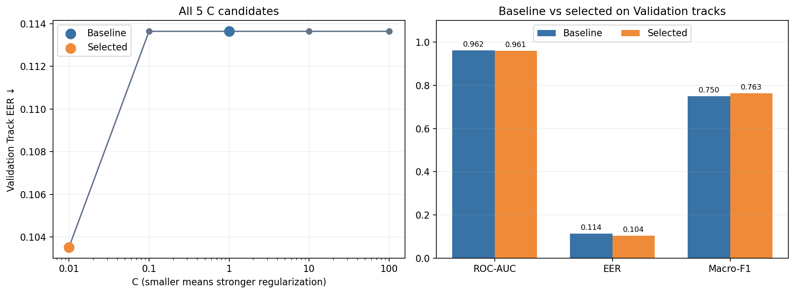
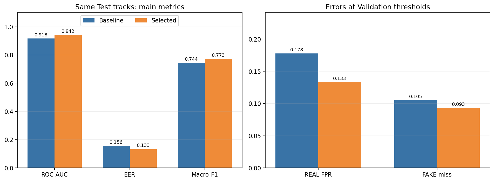
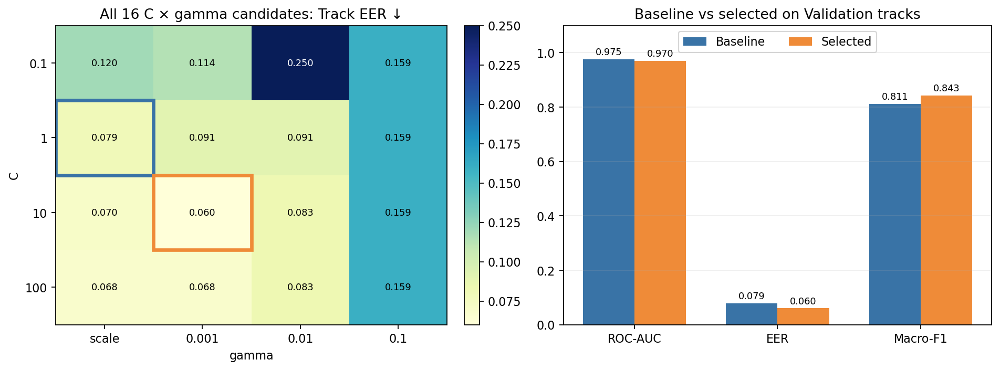
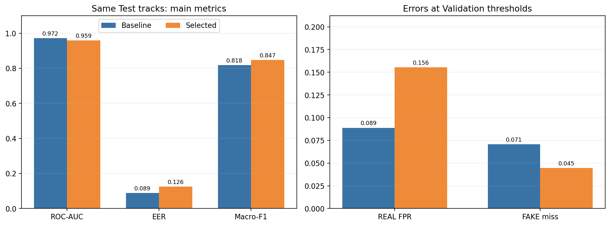
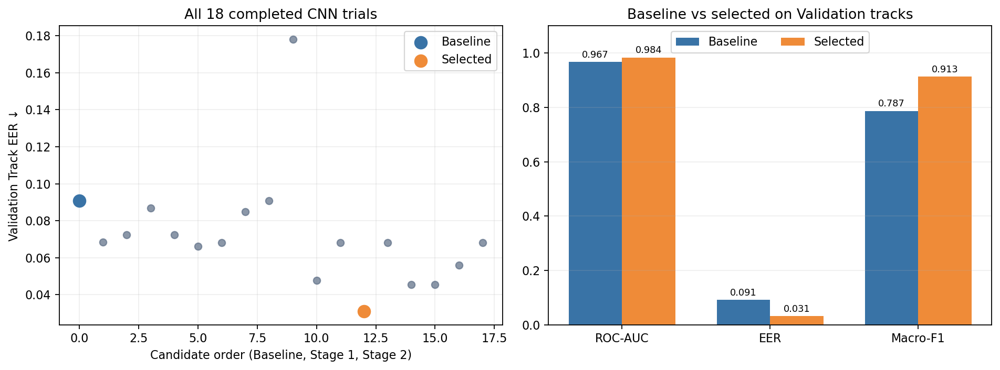
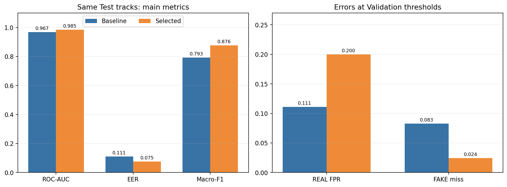
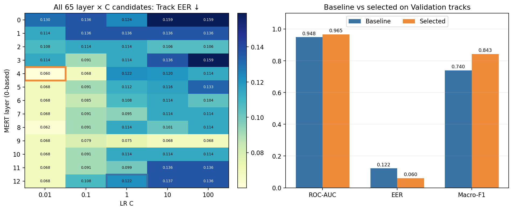
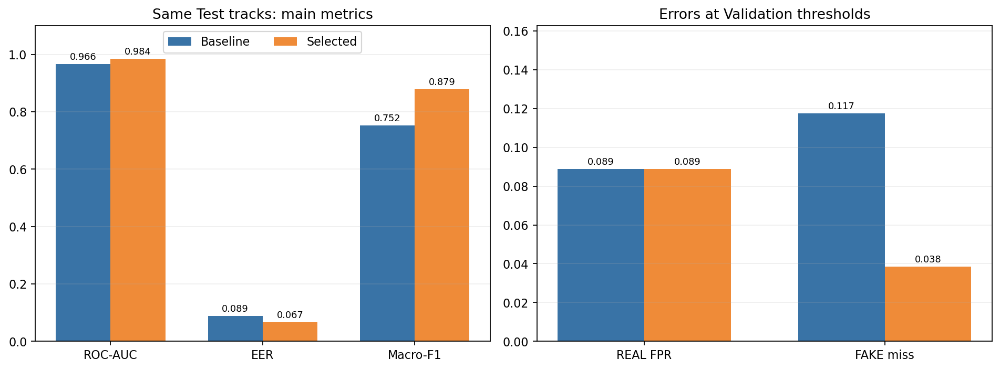
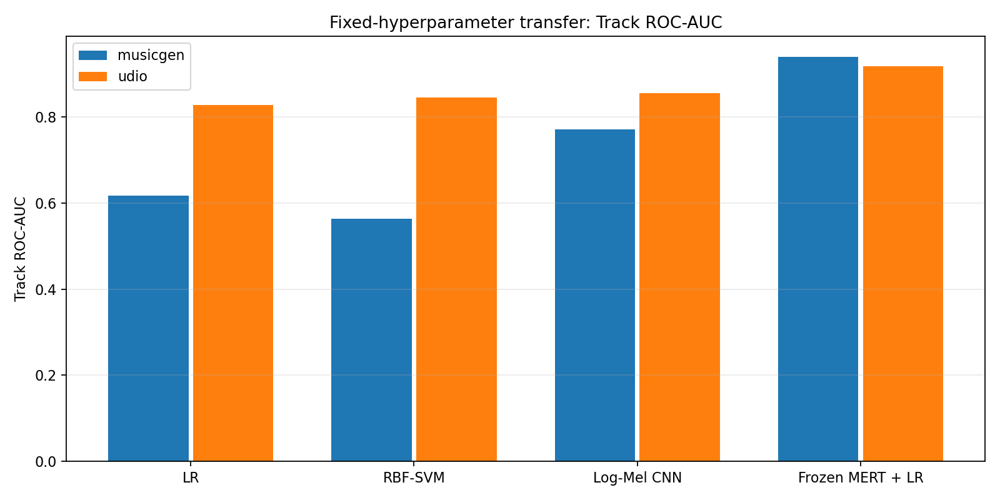
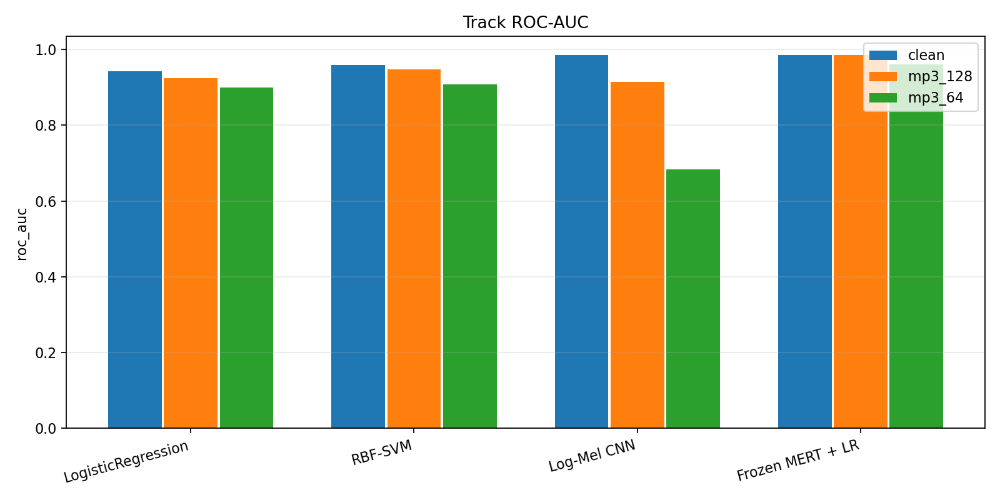

# 요약

실제 음악(REAL)과 AI 생성 음악(FAKE)을 구분하기 위해 Logistic Regression(LR), RBF-SVM, Log-Mel CNN, Frozen MERT+LR 네 모델을 비교했다. 각 모델의 설정은 Train·Validation에서 정하고, Baseline과 선택 모델을 같은 539곡 Test에서 평가했다. 곡 단위 EER은 선택 모델 기준 MERT 0.0667, CNN 0.0749, SVM 0.1255, LR 0.1333이었다. 다만 SVM은 Validation EER이 낮아진 설정을 선택했어도 Test EER은 Baseline보다 높았다. 따라서 이 보고서에서 ‘선택 모델’은 **Validation 기준으로 고른 모델**을 뜻하며, Test의 모든 지표가 향상됐다는 의미가 아니다.

같은 설정으로 MusicGen과 Udio를 각각 학습에서 제외하는 실험과 MP3 압축 평가도 수행했다. MERT는 두 생성기에서 네 모델 중 가장 높은 곡 단위 AUC를 보였다. 64 kbps MP3에서는 CNN의 AUC가 paired clean 0.9847에서 0.6839로 크게 낮아졌다. 별도의 12종 생성기 분류에서는 MERT 표현을 이용한 LR의 곡 단위 Macro-F1이 전체 자료에서 0.9384, 원곡과 생성기 구성을 통제한 자료에서 0.8980이었다.

이 보고서의 이진 공동 Test 실행 ID는 `final_binary_20260919T164939Z`이다. 본문에 표시한 성능은 별도 표기가 없으면 **곡(Track) 단위**다. 2026년 9월 13일의 초기 Test 결과는 이전 실험으로 보존하고, 아래 Baseline·선택 모델 비교에는 같은 공동 Test 실행의 결과만 사용했다.

# 1. 데이터와 평가 설계

## 1.1 데이터와 분할

REAL은 FMA, FAKE는 Echoes TTA에서 가져왔다. 정제된 3,458곡을 10초 구간 10,077개로 나누었다. 동일한 `original_audio`에서 파생된 REAL, FAKE 및 모든 구간을 같은 분할에 넣어 원곡 내용이 Train과 Test에 동시에 나타나지 않도록 했다.

| 단위 | 전체 | Train | Validation | Test |
|:--|--:|--:|--:|--:|
| 원곡 그룹 | 296 | 207 | 44 | 45 |
| 곡 | 3,458 | 2,392 | 527 | 539 |
| 10초 구간 | 10,077 | 6,967 | 1,538 | 1,572 |
| REAL 곡 | 296 | 207 | 44 | 45 |
| FAKE 곡 | 3,162 | 2,185 | 483 | 494 |

수작업 특징 266차원은 LR과 SVM에, 128×1001 Log-Mel 스펙트로그램은 CNN에, MERT의 13개 표현 층에서 나온 768차원 벡터는 MERT+LR에 사용했다. 각 모델이 구간마다 낸 점수를 같은 곡 안에서 산술평균해 곡 점수로 만들었다.

## 1.2 모델 선택과 지표

Scaler와 분류기 가중치는 Train에서만 학습했다. 각 후보의 Validation **곡 단위 EER 최소**를 먼저 비교하고, 동률이면 곡 단위 ROC-AUC가 높은 후보를 선택했다. CNN의 checkpoint epoch와 Segment·Track 판정 임계값도 Validation에서 정했다. 모든 설정을 동결한 뒤 Baseline과 선택 모델을 공동 Test에서 평가했다. Train+Validation 재학습이나 Test 결과에 따른 재선택은 하지 않았다.

EER은 점수의 분리력을 요약하기 위해 Test에서도 계산하지만, 이때의 임계값으로 Test 예측을 다시 만들지 않는다. Test의 Macro-F1, REAL 오탐률(FPR), FAKE 미탐률에는 **각 모델과 단위에 대응하는 Validation 임계값**을 적용했다. Test에는 REAL 45곡, FAKE 494곡이 있어 다수 클래스의 정확도 하나만으로 평가하면 오류를 놓치기 쉽다. 본문에서는 선택 지표 EER과 순위 분리력 ROC-AUC를 우선 보고, 실제 오류 방향은 REAL FPR과 FAKE miss로 확인한다.

# 2. 모델별 튜닝: Validation 선택과 Test 확인

아래 네 절의 첫 그림은 **Validation 후보 탐색과 Baseline 비교**, 두 번째 그림은 **이미 저장된 공동 Test의 Baseline 비교**다. Test 그림은 설정 선택에 사용하지 않았다. 모든 그림의 원본 코드와 실행 출력은 해당 튜닝 노트북 맨 끝에 있다.

## 2.1 Logistic Regression

LR은 266차원 수작업 특징으로 만드는 선형 기준선이다. Train에서만 `StandardScaler`를 맞추고 `class_weight="balanced"`, L2 규제, `lbfgs`를 사용했다. `lbfgs`에는 CNN처럼 직접 지정하는 학습률이 없으므로, 규제 강도를 결정하는 `C`를 0.01·0.1·1·10·100으로 비교했다. `C`가 작을수록 규제가 강하다. Baseline은 `C=1`, 선택 설정은 `C=0.01`이다.

| 평가 집합 | 설정 | ROC-AUC ↑ | EER ↓ | Macro-F1 ↑ |
|:--|:--|--:|--:|--:|
| Validation | Baseline | 0.9621 | 0.1136 | 0.7499 |
| Validation | 선택 모델 | 0.9607 | 0.1035 | 0.7634 |
| Test | Baseline | 0.9176 | 0.1556 | 0.7443 |
| Test | 선택 모델 | 0.9419 | 0.1333 | 0.7726 |

{width=6.25in}

*그림 1. LR의 C 후보 5개와 Validation Baseline·선택 모델 비교. 자료: `logistic_tuning.csv`.*

{width=6.25in}

*그림 2. 동일 Test 539곡에서 LR의 Baseline·선택 모델 비교. 오른쪽 오류율에는 Validation 임계값을 적용했다.*

Validation AUC는 `C=0.1`에서 조금 높았지만, 사전에 정한 EER 우선 규칙에 따라 `C=0.01`을 골랐다. Test에서는 AUC와 EER 모두 Baseline보다 좋아졌고, REAL FPR도 0.1778에서 0.1333으로 낮아졌다. 이 결과는 수작업 특징에 선형 경계를 적용한 기준선이 유용함을 보여준다.

## 2.2 RBF-SVM

SVM은 LR과 같은 266차원 특징에 비선형 RBF 경계를 적용한다. `C` 네 값과 `gamma` 네 값으로 16개 후보를 만들었다. Baseline은 `C=1, gamma=scale`, 선택 모델은 `C=10, gamma=0.001`이다. `class_weight="balanced"`를 적용했고, FAKE 점수에는 `decision_function`의 margin을 사용했다. 이 값은 확률이 아니다.

| 평가 집합 | 설정 | ROC-AUC ↑ | EER ↓ | Macro-F1 ↑ |
|:--|:--|--:|--:|--:|
| Validation | Baseline | 0.9753 | 0.0787 | 0.8113 |
| Validation | 선택 모델 | 0.9705 | 0.0600 | 0.8426 |
| Test | Baseline | 0.9717 | 0.0889 | 0.8185 |
| Test | 선택 모델 | 0.9586 | 0.1255 | 0.8470 |

{width=6.25in}

*그림 3. SVM 16개 후보의 Validation EER. 파란 테두리는 Baseline, 주황 테두리는 선택 설정이다.*

{width=6.25in}

*그림 4. 동일 Test의 SVM 비교. 선택 모델은 FAKE miss가 줄었지만 REAL FPR이 늘었다.*

선택 모델의 Validation EER은 낮았으나 Test AUC는 0.9717에서 0.9586, EER은 0.0889에서 0.1255로 악화됐다. 반대로 FAKE miss는 0.0709에서 0.0445로 줄고 Macro-F1은 높아졌다. **SVM 튜닝이 Test에서 전반적 성능 향상을 달성했다고 쓰지 않는다.** Test를 본 뒤 Baseline으로 설정을 바꾸면 평가 절차가 달라지므로, 사전 선택 결과와 악화된 Test 결과를 함께 보고한다.

## 2.3 Log-Mel CNN

CNN은 스펙트로그램의 시간·주파수 구조에서 패턴을 학습한다. 네 개의 ConvBlock 뒤에 전역 평균 풀링과 분류층을 두었다. FAKE가 많은 Train 구간 수를 기준으로 `BCEWithLogitsLoss(pos_weight=Train REAL/Train FAKE)`를 사용했고, optimizer는 AdamW다. Baseline과 학습률·dropout 후보를 먼저 비교한 뒤 batch size·weight decay를 비교했다. 중복을 제외한 총 18개 trial 중 `cnn_s2_12`를 선택했다.

| 설정 | 학습률 | Dropout | Batch | Weight decay | 선택 epoch |
|:--|--:|--:|--:|--:|--:|
| Baseline | 1e-3 | 0.3 | 32 | 1e-4 | 13 |
| 선택 모델 | 3e-4 | 0.3 | 16 | 1e-3 | 17 |

| 평가 집합 | 설정 | ROC-AUC ↑ | EER ↓ | Macro-F1 ↑ |
|:--|:--|--:|--:|--:|
| Validation | Baseline | 0.9671 | 0.0909 | 0.7866 |
| Validation | 선택 모델 | 0.9837 | 0.0311 | 0.9132 |
| Test | Baseline | 0.9673 | 0.1111 | 0.7933 |
| Test | 선택 모델 | 0.9845 | 0.0749 | 0.8764 |

{width=6.25in}

*그림 5. 완료된 CNN 18개 trial의 Validation 곡 단위 EER와 Baseline·선택 모델 비교.*

{width=6.25in}

*그림 6. 공동 Test에서 CNN의 성능과 오류 방향. 판정 오류율은 각 설정의 Validation 임계값 기준이다.*

Test AUC·EER과 FAKE miss는 개선됐지만 REAL FPR은 0.1111에서 0.2000으로 늘었다. 45개 REAL 중 오탐이 5곡에서 9곡으로 증가한 것이다. **점수 분리력 향상과 고정 임계값에서의 오탐 감소는 같은 주장이 아니다.**

## 2.4 Frozen MERT + Logistic Regression

MERT encoder는 동결하고, 13개 표현 층(인덱스 0~12)에서 각기 768차원 벡터를 추출했다. 층마다 Train 기준으로 표준화하고 LR을 학습했다. 층 13개와 LR의 `C` 5개를 결합한 65개 후보 중 Validation 곡 단위 EER이 가장 낮은 조합을 골랐다. Baseline은 `layer=12, C=1`, 선택 모델은 `layer=4, C=0.01`이다. 층 번호는 코드에서 0부터 센다.

| 평가 집합 | 설정 | ROC-AUC ↑ | EER ↓ | Macro-F1 ↑ |
|:--|:--|--:|--:|--:|
| Validation | Baseline | 0.9482 | 0.1222 | 0.7396 |
| Validation | 선택 모델 | 0.9653 | 0.0600 | 0.8426 |
| Test | Baseline | 0.9664 | 0.0889 | 0.7515 |
| Test | 선택 모델 | 0.9845 | 0.0667 | 0.8787 |

{width=6.25in}

*그림 7. MERT의 65개 layer×C 후보. 파란 테두리는 Baseline, 주황 테두리는 선택 조합이다.*

{width=6.25in}

*그림 8. 공동 Test의 MERT 비교. FAKE miss는 0.1174에서 0.0385로 낮아졌고 REAL FPR은 0.0889로 같았다.*

`layer=9, C=0.01`의 Validation AUC 0.9791은 선택 조합의 0.9653보다 높았지만, EER은 0.0682로 `layer=4, C=0.01`의 0.0600보다 높았다. 이 차이는 선택 기준에 따른 결과다. MERT는 외부 음악 자료로 사전학습됐으므로 현재 자료에서 처음부터 학습한 CNN과 같은 학습 정보량을 가진 모델로 해석할 수 없다.

# 3. 공동 Test에서의 네 모델 비교

선택 모델만 놓고 보면 CNN과 MERT의 AUC는 각각 0.984525와 0.984480으로 거의 같다. EER은 MERT가 더 낮고, 오류 방향은 다르다.

| 선택 모델 | ROC-AUC ↑ | EER ↓ | REAL FPR ↓ | FAKE miss ↓ |
|:--|--:|--:|--:|--:|
| Logistic Regression | 0.9419 | 0.1333 | 0.1333 | 0.0931 |
| RBF-SVM | 0.9586 | 0.1255 | 0.1556 | 0.0445 |
| Log-Mel CNN | 0.9845 | 0.0749 | 0.2000 | 0.0243 |
| Frozen MERT + LR | 0.9845 | 0.0667 | 0.0889 | 0.0385 |

CNN은 FAKE를 가장 적게 놓쳤고, MERT는 REAL 오탐과 EER이 더 낮았다. 어느 오류가 더 중요한지에 따라 운영 임계값의 판단은 달라질 수 있다. 그러나 이 보고서에서는 Test에 맞춰 임계값을 조정하지 않았다. 전체 Segment·Track 지표와 각 모델의 Baseline 행은 `results/model_tuning/optimized_test_results.csv`에 있다.

# 4. 강건성: 학습에서 제외한 생성기와 MP3 압축

## 4.1 MusicGen·Udio 고정 설정 전이

초기 부분집합 분석에서 MusicGen은 SVM의 생성기별 in-domain Test AUC가 0.9951, Udio는 0.9014였다. 곡 수는 전체에서 각각 293·300개로 비슷하지만 포함된 원곡 수는 293·151개다. 두 대상은 기존 후속 분석과 연결되는 **성능과 원곡 구성의 대조 사례**다. 이 선택은 이전 Test 분석을 본 뒤 이루어진 탐색적 선택이며, 두 생성기가 전체 12개 생성기를 대표한다는 뜻은 아니다.

주 강건성 실험에서는 대상 FAKE를 Train·Validation에서 제거하고 네 모델을 해당 Train에서 처음부터 다시 학습했다. Main 실험에서 정한 하이퍼파라미터는 고정했고, 필터된 Validation으로 CNN checkpoint와 판정 임계값만 골랐다. Test는 모든 선택 후 원래 REAL 45곡과 해당 생성기의 FAKE만 평가했다.

| 제외한 생성기 | Test 구성 | LR AUC | SVM AUC | CNN AUC | MERT AUC |
|:--|:--|--:|--:|--:|--:|
| MusicGen | REAL 45 + FAKE 45 | 0.6178 | 0.5640 | 0.7714 | 0.9407 |
| Udio | REAL 45 + FAKE 48 | 0.8278 | 0.8449 | 0.8551 | 0.9181 |

{width=6.0in}

*그림 9. 두 대상에서의 곡 단위 AUC. 자세한 EER·오류율은 `unseen_fixed_four_model_comparison.csv`에 있다.*

MERT는 두 대상 모두 네 모델 중 가장 높은 AUC를 보였다. MusicGen에서 LR·SVM의 FAKE miss는 각각 0.8000·0.8667이었다. Udio FAKE 48곡은 원곡 24개에서 나왔으므로 MusicGen의 45곡·45원곡과 조건이 같지 않다. 또한 **Main 하이퍼파라미터를 고른 원래 Validation에는 두 생성기가 포함돼 있었다.** 그러므로 이는 학습 가중치의 고정 설정 전이 결과이며, 하이퍼파라미터 선택까지 완전히 미노출된 외부 검증은 아니다. 대상별 하이퍼파라미터 재탐색 결과는 별도 보조 실험으로 보존했다.

## 4.2 같은 곡의 MP3 압축 전후

같은 Test 539곡을 paired clean, MP3 128 kbps, MP3 64 kbps로 대응시켰다. 선택 모델과 원래 clean Validation 임계값을 모든 조건에 고정했다. paired clean은 압축 조건과 디코딩 경로를 맞춰 새로 추출했으므로, 앞의 공동 Test clean 수치와 소폭 다를 수 있다.

| 모델 | paired clean AUC | 128 kbps AUC | 64 kbps AUC |
|:--|--:|--:|--:|
| Logistic Regression | 0.9429 | 0.9237 | 0.9001 |
| RBF-SVM | 0.9582 | 0.9464 | 0.9072 |
| Log-Mel CNN | 0.9847 | 0.9146 | 0.6839 |
| Frozen MERT + LR | 0.9845 | 0.9851 | 0.9605 |

{width=6.0in}

*그림 10. paired clean과 MP3 조건의 같은 곡 단위 AUC.*

CNN은 64 kbps에서 AUC가 약 0.3008 낮아졌고, 고정 임계값에서 REAL 45곡 중 40곡을 FAKE로 오탐했다. MERT의 64 kbps AUC는 0.9605였지만 REAL FPR은 paired clean보다 높아졌다. 압축 종류와 변환 절차를 더 넓혀 확인하기 전에는 특정 모델의 일반적인 codec 강건성을 단정할 수 없다.

# 5. 12종 생성기 분류

이진 탐지가 “AI인가?”를 묻는다면 생성기 분류는 FAKE 음악이 12개 생성기 중 어디에서 왔는지를 묻는다. 수작업 특징+RBF-SVM과 Frozen MERT 표현+LR을 비교했다. 전체 자료 외에, 12개 생성기가 모두 존재하는 원곡 119개를 골라 각 원곡×생성기에서 한 곡만 남기는 strict balanced 실험도 수행했다.

| Test 자료 | Handcrafted+SVM Macro-F1 | MERT+LR Macro-F1 |
|:--|--:|--:|
| Full | 0.8840 | 0.9384 |
| Strict balanced | 0.7447 | 0.8980 |

이 분류는 12개 중 하나를 고르는 문제라 이진 탐지의 단일 EER 임계값을 그대로 적용하지 않는다. 따라서 각 생성기 F1을 같은 비중으로 평균한 **Validation 곡 단위 Macro-F1**으로 MERT 층을 선택했다. 이 기준에서 layer 10은 0.9396, 탐지 실험이 선택한 layer 4는 0.9073이었다. 이진 탐지에서 선택된 `layer=4, C=0.01`을 다른 목표의 12종 분류에 그대로 가져오지 않은 이유다. 층 인덱스는 모두 0부터 센다.

{width=5.4in}

*그림 11. MERT+LR의 Full Test 곡 단위 생성기 혼동행렬.*

Strict balanced 자료의 MERT 생성기 silhouette는 원래 표현 공간에서 0.0164로 작았다. 지도학습 Macro-F1이 높더라도 거리에 따라 깔끔하게 분리된 군집이 있다는 뜻은 아니다. PCA·UMAP과 단변량 음향 특징 분석은 생성기 표현의 차이를 살펴보는 탐색적 자료로 사용했다. 이 결과만으로 특정 음향 특징이 생성기의 고유한 인과적 흔적이라고 단정하지 않는다.

# 6. 결론과 해석 범위

네 모델 모두 Validation EER을 기준으로 Baseline보다 낮은 후보를 선택했다. 공동 Test에서는 LR·CNN·MERT의 EER이 낮아졌지만 SVM은 높아졌다. 선택 과정과 최종 평가를 나눠 기록해야 하는 이유가 여기에 있다. CNN은 FAKE를 가장 적게 놓친 반면 REAL 오탐과 64 kbps 압축에서 약점을 보였고, MERT는 낮은 EER과 비교적 안정적인 생성기 전이 성능을 보였다. 생성기 분류에서도 MERT 표현이 수작업 특징보다 높은 Macro-F1을 기록했다.

결론에는 다음 조건이 따른다. REAL과 FAKE의 자료 출처가 달라 녹음·코덱·장르 차이가 생성 여부와 섞일 수 있다. 공동 Test의 REAL은 45곡이라 몇 곡의 오탐만으로 FPR이 크게 변한다. 이전 분석에서 같은 Test의 결과가 이미 공개돼 이번 공동 Test를 완전히 미사용한 독립 평가로 부를 수 없다. MusicGen·Udio 역시 탐색적으로 선택됐고, Main 하이퍼파라미터 선택 단계에서는 원래 Validation에 포함돼 있었다. MERT는 외부 사전학습 정보를 사용하며, 그 데이터와 평가 자료의 중복 여부는 확인되지 않았다. MP3 평가는 한 변환 절차와 두 bitrate에 한정된다.

후속 연구에서는 12개 생성기 전체를 대상으로 선택 단계까지 분리한 leave-one-generator-out 평가, 더 다양한 압축·재인코딩 조건, 원곡 단위 신뢰구간을 우선 검토할 필요가 있다.

# 자료 위치

| 내용 | 프로젝트 파일 |
|:--|:--|
| LR·SVM 후보 및 Validation·Test 비교 | `archive_notebooks/22_classical_model_tuning.ipynb` |
| CNN 후보 및 Validation·Test 비교 | `archive_notebooks/13B_logmel_cnn_tuning.ipynb` |
| MERT 후보 및 Validation·Test 비교 | `archive_notebooks/17B_mert_binary_tuning.ipynb` |
| 네 모델 공동 Test 원본 표 | `results/model_tuning/optimized_test_results.csv` |
| MusicGen·Udio 고정 설정 전이 | `results/model_robustness/unseen_fixed_four_model_comparison.csv` |
| Paired MP3 조건별 지표 | `results/model_robustness/mp3/mp3_optimized_20260919T175101Z/metrics.csv` |
| 생성기 분류 | `archive_notebooks/19_generator_attribution_mert.ipynb` |

비교 그림과 표는 위 실행 기록에 저장된 수치와 CSV를 사용했다. Word 보고서 작성 과정에서 학습·튜닝·Test 평가를 다시 실행하지 않았다.
