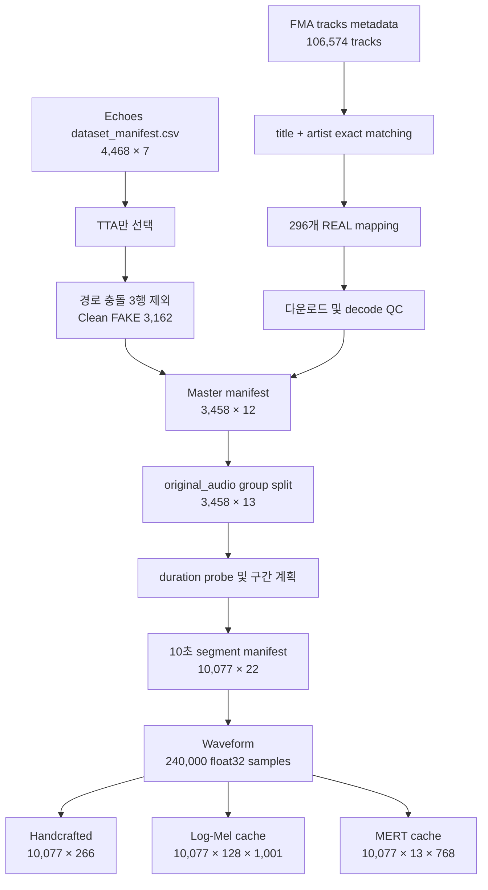

# 데이터 전처리 및 데이터 구조 상세

이 문서는 원본 Echoes/FMA 데이터가 모델 입력으로 변환되는 과정을 파일 단위, 컬럼 단위, 배열 shape 단위로 설명합니다. 수치는 2026-09-13 최종 산출물을 직접 읽어 확인한 값입니다.

## 1. 전체 데이터 흐름



## 2. 원본 Echoes manifest

파일: `data/raw/Echoes/Echoes/dataset_manifest.csv`

- Shape: **(4,468, 7)**
- 결측값: 0
- `original_audio`: 296개
- Generator: 12종
- Type: TTA 3,165 / ATA 1,303
- Genre: Electronic 1,653 / Rock 1,594 / Pop 1,221

| 컬럼 | dtype | 의미 |
|---|---|---|
| `path_in_dataset` | string | Echoes root 기준 상대 오디오 경로 |
| `original_audio` | string | 생성의 reference가 된 원곡 식별 문자열 |
| `generator` | string | AI 생성기 이름 |
| `type` | string | TTA 또는 ATA 생성 유형 |
| `genre` | string | Electronic, Pop, Rock |
| `description` | string | 생성에 사용된 설명/prompt metadata |
| `duration` | float | manifest에 기록된 길이(초) |

### 2.1 FAKE 정제

연구 범위는 텍스트 기반 생성 음악인 TTA로 제한했습니다. ATA 1,303행은 제외했습니다. MusicGen의 동일 실제 파일 하나가 서로 다른 세 원곡을 참조하는 경로 충돌이 있어 해당 3행을 모두 제외했습니다.

```text
Echoes 4,468
├── ATA 1,303 → 연구 범위에서 제외
└── TTA 3,165
    ├── 경로 충돌 3 → 제외
    └── Clean TTA 3,162
```

Clean TTA의 실제 파일 누락은 0개입니다. Manifest 밖에서 발견된 extra audio 24개는 신뢰할 metadata 연결이 없으므로 포함하지 않았습니다.

## 3. FMA REAL 매칭과 검증

### 3.1 Metadata matching

Echoes `original_audio`의 제목과 아티스트 문자열을 정규화한 `match_key`를 만들고 FMA `tracks.csv`의 title/artist와 exact matching했습니다.

| 매칭 상태 | Original-audio 수 |
|---|---:|
| 후보 1개 | 279 |
| 후보 2개 이상 | 17 |
| 후보 없음 | 0 |
| 합계 | 296 |

복수 후보는 다음 결정 규칙으로 하나를 선택했습니다.

1. CC0, CC-BY 또는 Public Domain 허용 라이선스 우선
2. Echoes `genre`와 FMA `genre_top` 일치 후보 우선
3. 동일 조건이면 가장 작은 `track_id` 선택
4. 허용 라이선스 후보가 없으면 장르 일치 후 최소 `track_id`로 fallback

최종 mapping은 **296행 × 13열**이고 `original_audio`와 `track_id`가 모두 고유합니다. Echoes genre와 FMA genre는 296/296 일치합니다.

| FMA subset | Track 수 |
|---|---:|
| small | 122 |
| medium | 103 |
| large | 71 |

### 3.2 Mapping schema

파일: `data/metadata/fma_real_mapping.csv`

| 컬럼군 | 컬럼 | 의미 |
|---|---|---|
| Join key | `original_audio`, `genre` | Echoes reference와 장르 |
| FMA identity | `track_id`, `title`, `artist` | 선택된 실제 음악 |
| FMA metadata | `genre_top`, `license`, `duration`, `subset` | 원본 FMA 속성 |
| Selection QC | `candidate_count`, `license_allowed`, `license_fallback`, `genre_match` | 후보 선택 근거 |

### 3.3 Audio validation

파일: `data/metadata/fma_real_audio_validation.csv`, shape **(296, 20)**

Mapping 13열에 `path`, `size_bytes`, `decode_ok`, `duration_sec`, `decode_error`, `file_exists`, `size_ok` 7개 검증 열을 추가했습니다.

- File missing: 0
- 비정상 크기: 0
- Decode failure: 0
- 10초 미만: 0
- 0초 이하 또는 31초 초과로 처리된 선택 clip: 0

`decode_error`의 296개 결측은 오류가 없을 때 빈 값으로 저장한 정상 상태입니다.

## 4. Master manifest

파일: `data/metadata/master_manifest.csv`

- Shape: **(3,458, 12)**
- REAL: 296
- FAKE: 3,162
- Source: FMA 296 / Echoes 3,162
- Genre: Electronic 1,249 / Rock 1,238 / Pop 971
- File extension: MP3 3,165 / WAV 293
- 실제 파일 존재: 3,458/3,458

| 컬럼 | 의미 |
|---|---|
| `sample_id` | Track 단위 내부 식별자 |
| `original_audio` | 누수 방지와 aggregation에 사용하는 source-family key |
| `label`, `label_id` | REAL/0, FAKE/1 |
| `source` | FMA 또는 Echoes |
| `genre` | 통일된 3개 장르 |
| `generator` | FAKE 생성기; REAL에서는 비어 있음 |
| `audio_path` | 프로젝트 root 기준 실제 파일 상대 경로 |
| `track_id` | FMA REAL ID; FAKE에서는 비어 있음 |
| `description` | Echoes FAKE prompt; REAL에서는 비어 있음 |
| `path_in_dataset` | Echoes 상대 경로; REAL에서는 비어 있음 |
| `file_exists` | manifest 구축 시 파일 존재 여부 |

Master manifest의 결측은 데이터 오류가 아니라 REAL/FAKE에 적용되는 metadata가 다르기 때문에 발생합니다. 예를 들어 REAL 296행의 `generator`가 비어 있고, FAKE 3,162행의 FMA `track_id`가 비어 있는 것이 정상입니다.

## 5. Group split

파일:

- `data/metadata/original_audio_split.csv`: **(296, 6)**
- `data/metadata/master_manifest_with_split.csv`: **(3,458, 13)**

### 5.1 분할 규칙

1. 3,458개 track을 `original_audio`로 groupby
2. 각 group에 REAL 1개가 있고 genre가 하나로 일관되는지 확인
3. `random_state=42`, genre stratification으로 Train 70%, 임시 30% 분할
4. 임시 group을 genre stratification으로 Validation/Test 1:1 분할
5. Group의 split을 모든 REAL/FAKE track에 many-to-one join

| 단위 | Train | Validation | Test | 전체 |
|---|---:|---:|---:|---:|
| Original-audio group | 207 | 44 | 45 | 296 |
| Track | 2,392 | 527 | 539 | 3,458 |
| REAL track | 207 | 44 | 45 | 296 |
| FAKE track | 2,185 | 483 | 494 | 3,162 |

Train∩Validation, Train∩Test, Validation∩Test의 `original_audio` 교집합은 모두 0입니다.

## 6. Duration 측정과 10초 segmentation

파일: `data/metadata/segment_manifest_10s.csv`, shape **(10,077, 22)**

### 6.1 Duration

`ffprobe`로 실제 파일 duration을 측정하고 `audio_duration_cache.csv`에 저장합니다. 30초와의 차이가 0.1초 이하인 파일은 codec metadata 오차로 보고 segmentation 계획상 30.0초로 정규화합니다.

- 실제 duration 범위: 17.96–479.96초
- 평균 실제 duration: 116.14초
- Duration probe 실패: 0
- 10초 미만으로 제외된 track: 0

### 6.2 Segment 위치 선택

전체 오디오를 잘게 겹쳐 자르지 않고 곡의 서로 다른 위치를 대표하도록 최대 세 구간을 선택했습니다.

| Planning duration | 생성 구간 | 역할 |
|---|---:|---|
| `d >= 30` | 3 | `start=0`, `middle=(d-10)/2`, `end=d-10` |
| `20 <= d < 30` | 2 | `start=0`, `end=d-10` |
| `10 <= d < 20` | 1 | `center=(d-10)/2` |
| `d < 10` 또는 probe 실패 | 0 | exclusion report |

최종 track 분포는 3 segments 3,163곡, 2 segments 293곡, 1 segment 2곡입니다.

| Segment role | 수 |
|---|---:|
| start | 3,456 |
| middle | 3,163 |
| end | 3,456 |
| center | 2 |

### 6.3 Padding

모든 모델 입력은 정확히 10초로 맞춥니다. 실제 decode 결과가 계획된 끝점보다 조금 짧으면 뒤쪽을 0으로 padding합니다.

- Padding 없음: 9,614 segments
- Padding 있음: 463 segments
- 최대 padding: 0.06초
- Padding segment 평균: 약 0.042초

Padding은 주로 30초 근처 MP3의 수십 ms codec duration 차이에서 발생합니다.

### 6.4 Segment schema

| 컬럼군 | 컬럼 |
|---|---|
| IDs | `segment_id`, `track_sample_id`, `original_audio` |
| Target/source | `label`, `label_id`, `source`, `genre`, `generator`, `track_id` |
| Location | `audio_path`, `segment_index`, `segment_role`, `start_sec`, `end_sec` |
| Split | `split` |
| Duration QC | `actual_duration_sec`, `planning_duration_sec`, `planned_segments`, `segment_duration_sec`, `available_audio_sec`, `pad_sec`, `requires_padding` |

Segment 분포는 Train 6,967 / Validation 1,538 / Test 1,572이며, REAL 888 / FAKE 9,189입니다. 각 segment는 부모 track의 split을 그대로 상속합니다.

## 7. 공통 waveform 입력

세 표현은 동일한 segment definition을 사용합니다.

```text
sample rate     = 24,000 Hz
channel         = mono
duration        = 10 seconds
target samples  = 240,000
dtype           = float32
short decode    = zero-padding at the end
long decode     = truncate to 240,000 samples
```

`librosa.load`가 resampling과 mono conversion을 수행합니다. 따라서 원본이 MP3/WAV 또는 서로 다른 sample rate여도 모델 입력 waveform shape는 `(240000,)`으로 동일합니다.

## 8. Handcrafted feature table

파일: `data/processed/features/handcrafted_features_10s.csv`

- 전체 shape: **(10,077, 284)**
- Metadata/QC columns: 18
- Numeric feature columns: 266
- Numeric feature NaN/Inf: 0/0
- Segment ID 누락·추가·중복: 0/0/0

| Feature family | 원 feature 수 | 요약 | 최종 차원 |
|---|---:|---|---:|
| MFCC | 40 | 각 coefficient의 시간축 mean/std | 80 |
| MFCC delta | 40 | mean/std | 80 |
| MFCC delta-delta | 40 | mean/std | 80 |
| Spectral centroid | 1 | mean/std | 2 |
| Spectral bandwidth | 1 | mean/std | 2 |
| Spectral rolloff 85% | 1 | mean/std | 2 |
| Spectral flatness | 1 | mean/std | 2 |
| Spectral contrast | 7 bands | band별 mean/std | 14 |
| RMS | 1 | mean/std | 2 |
| Zero-crossing rate | 1 | mean/std | 2 |
| **합계** |  |  | **266** |

공통 spectral parameter는 `n_fft=1024`, `hop_length=240`, `n_mels=128`, `fmax=12000`입니다. Feature 단계에서는 scaling하지 않습니다. StandardScaler는 각 모델 실험에서 Train split에만 fit합니다.

CSV의 `error` 열은 10,077행 모두 비어 있으며 이는 추출 오류가 없다는 뜻입니다.

## 9. Log-Mel tensor

파일: `data/processed/logmel/logmel_10s_float16.npy`

| 속성 | 값 |
|---|---|
| Cache shape | **(10,077, 128, 1,001)** |
| dtype | `float16` |
| 저장 크기 | 약 2.405 GiB |
| 완료 mask | 10,077/10,077 |
| Sample rate | 24,000 Hz |
| FFT / hop | 1,024 / 240 |
| Mel bins | 128 |
| Frequency max | 12,000 Hz |
| Power | 2.0 |
| `center` | True |

`librosa.power_to_db(ref=np.max, top_db=80)`로 dB 변환한 뒤 `[-80, 0]`을 `[-1, 1]`로 선형 변환합니다. CNN 입력 시 `(batch, 1, 128, 1001)`의 float32 tensor로 읽습니다. 전체 cache는 memory map으로 접근해 RAM에 한 번에 적재하지 않습니다.

## 10. Frozen MERT tensor

파일: `data/processed/mert/mert95m_v2_layers_float16.npy`

| 속성 | 값 |
|---|---|
| Model | `m-a-p/MERT-v1-95M` |
| 고정 revision | `12af15fef9d0ac838c3f475bfbbf26d2060dd4f5` |
| 입력 sample rate | 24,000 Hz |
| Cache shape | **(10,077, 13, 768)** |
| dtype | `float16` |
| 저장 크기 | 약 0.187 GiB |
| 완료 mask | 10,077/10,077 |

13개 representation은 encoder 입력 표현 1개와 Transformer layer 출력 12개입니다. 각 layer의 time-step 표현을 시간축 평균해 segment당 768-D vector로 저장합니다.

Detection에서는 Validation Track EER가 가장 낮은 layer를 선택했고, 최종 v2 결과는 0-based **layer 9**를 사용합니다. Generator attribution에서는 Validation Track Macro-F1 기준으로 **layer 10**을 선택합니다. Layer 선택에 Test 결과는 사용하지 않습니다.

## 11. MP3 robustness용 데이터

Test 539곡만 FFmpeg로 MP3 128 kbps와 64 kbps로 재인코딩합니다. Original/128k/64k 모두 동일한 1,572개 segment ID와 시작점을 사용합니다.

```text
학습 및 Validation: original only
Test conditions: original / mp3_128 / mp3_64
Scaler/model/threshold: original Validation에서 확정 후 고정
재학습: 없음
```

Handcrafted feature는 조건별 CSV로 다시 추출하고, CNN은 full-decode Log-Mel cache를 별도로 생성합니다. 이 설계는 데이터 표본 차이가 아니라 codec 변환에 따른 입력 변화만 비교하기 위한 것입니다.

## 12. Strict-balanced generator attribution 데이터

Generator별 source coverage와 한 source당 생성 track 수의 차이를 제거하기 위해 다음 조건을 적용합니다.

1. 12개 generator가 모두 존재하는 `original_audio` 119개만 선택
2. 각 `original_audio × generator`에서 정렬상 첫 track 하나를 결정적으로 선택
3. 한 track의 1–3개 segment representation을 평균해 track당 vector 하나 생성
4. 기존 `original_audio` split 유지

| Split | Sources | Generator당 tracks | 총 tracks |
|---|---:|---:|---:|
| Train | 83 | 83 | 996 |
| Validation | 17 | 17 | 204 |
| Test | 19 | 19 | 228 |
| 전체 | 119 | 119 | 1,428 |

이 데이터에서는 source set, class 수, generator별 track 수, track당 feature vector 수가 모두 동일합니다.

## 13. 주요 QC 체크리스트

| 단계 | 검증 |
|---|---|
| Echoes | 충돌 경로 제거, 실제 파일 존재, generator/genre 범위 |
| FMA | 296개 mapping 고유성, 파일 크기, decode, duration |
| Master | 3,458행, group당 REAL 1개, genre 일관성, 파일 100% 존재 |
| Split | 296 groups 완전 할당, split 간 group overlap 0 |
| Segment | ID 고유성, 경계, 중복 시작점, 10초 목표, exclusion |
| Features | 10,077행 1:1 대응, 266열, NaN/Inf 0 |
| Log-Mel | `(10077,128,1001)`, 완료 mask 100% |
| MERT | `(10077,13,768)`, 완료 mask 100% |
| Robustness | 세 조건에서 동일 Test track/segment 유지 |
| Attribution | Train/Val/Test source overlap 0, strict class balance |

## 14. 저장 및 재현 시 주의점

- `data/raw/`, `data/processed/`, `checkpoints/`는 용량과 배포 조건 때문에 Git에서 제외됩니다.
- 저장소의 CSV/JSON/PNG 결과는 최종 수치와 분석 근거를 보존합니다.
- 데이터 재구축은 `01`부터 `08`까지 순서대로 실행합니다.
- 모델 실험은 group split과 segment manifest를 수정하지 않은 상태에서 실행해야 비교가 유효합니다.
- MERT는 `17_mert_frozen_baseline_v2.ipynb`의 고정 Transformers/model revision을 사용합니다.
- MP3 비교는 random seek가 아닌 최종 full-decode 결과를 기준으로 합니다.
