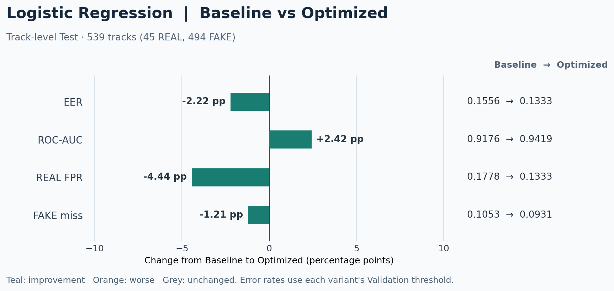
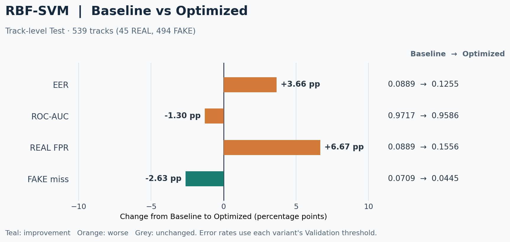
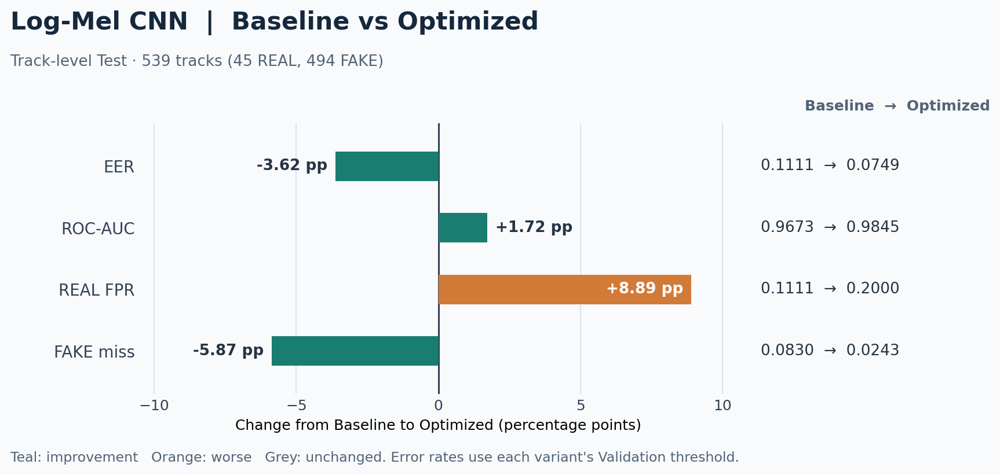
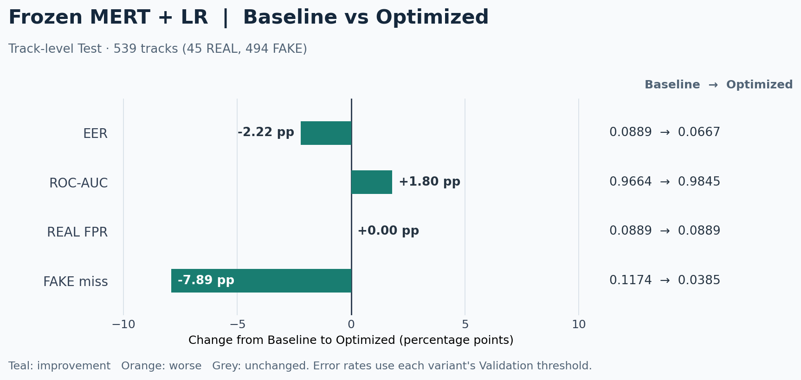
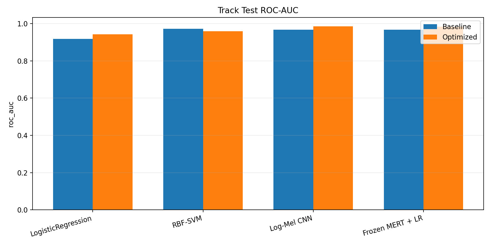
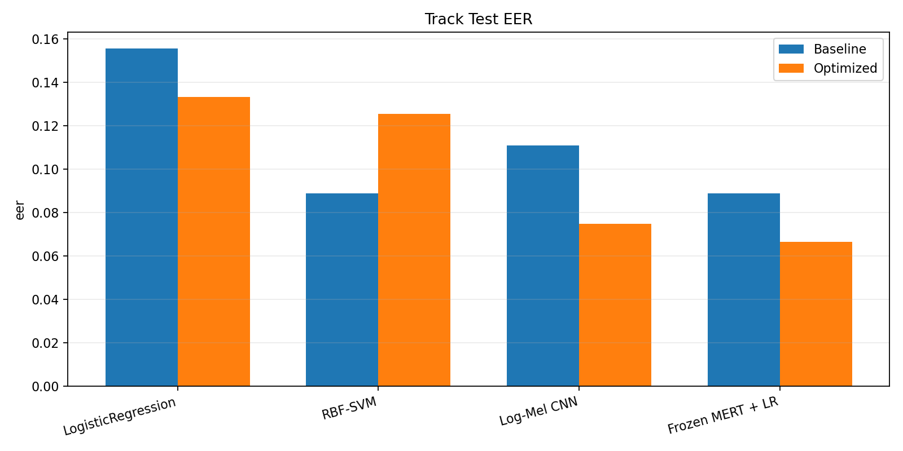
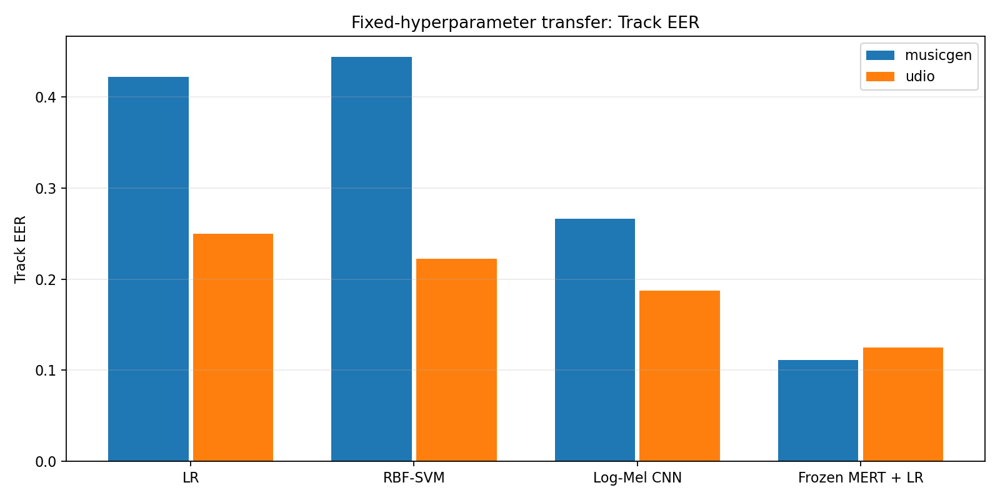
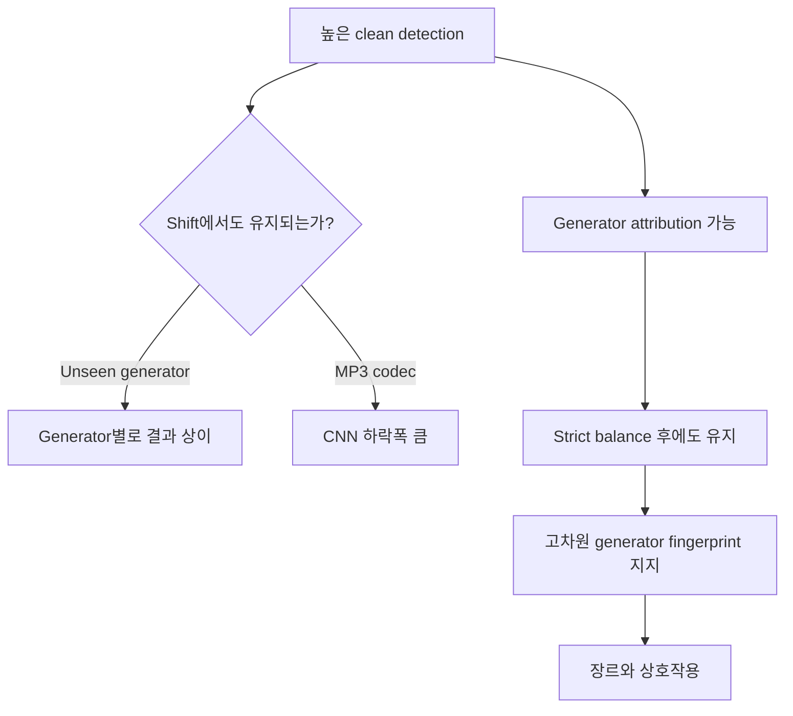

# 최종 분석 보고서

> 4.3절은 2026-09-20 공동 Test(run_id `final_binary_20260919T164939Z`), 5.3절은 paired MP3, 5.4절은 unseen generator 고정 설정 전이 결과입니다. 5.1·5.2절의 표는 2026-09-13 과거 실험 결과입니다. `historical_20260913`은 과거 실행에 원래 run_id가 없어 문서에서 구분용으로 붙인 라벨입니다. 제출 노트북은 [공동 Test 실행 기록](../archive_notebooks/23_final_binary_test_comparison.ipynb)과 [MP3 실행 기록](../archive_notebooks/24B_optimized_mp3_robustness.ipynb)입니다. 실행 절차와 unseen 조건은 각각 [모델링 수정 실행 안내](MODELING_REVISION.md), [고정 설정 전이 프로토콜](UNSEEN_FIXED_PROTOCOL.md)을 참고했습니다.

## 한눈에 보는 최신 결과

| 질문 | 관찰된 결과 | 상세 위치 |
|---|---|---|
| 같은 Test에서 어느 모델이 강한가? | Optimized Track EER은 MERT **0.0667**, CNN **0.0749**였다. | [4.3 공동 Test](#43-새-이진-모델-공동-test-2026-09-20) |
| 새 학습에서 제외한 생성기로 전이되는가? | 고정 설정의 MusicGen/Udio Track AUC는 MERT **0.9407/0.9181**, CNN **0.7714/0.8551**이었다. | [5.4 고정 설정 unseen](#54-새-primary-unseen-generator-고정-설정-전이-2026-09-20) |
| 압축 후 성능이 유지되는가? | 64 kbps에서 CNN Track AUC는 paired clean **0.9847→0.6839**로 낮아졌다. | [5.3 paired MP3](#53-새-optimized-네-모델의-paired-mp3-평가-2026-09-20) |

이진 탐지 본표는 EER·ROC-AUC·REAL FPR·FAKE miss를 사용한다. 앞의 두 지표는 점수의 분리력이고, 뒤의 두 지표는 **Validation 임계값을 고정한** 분류 결과다. 나머지 지표는 보조 결과 CSV에 남겼다. 위 수치는 서로 다른 평가 집합에서 나온 값이므로 한 줄의 순위로 합치지 않는다. 제출 파일을 읽는 순서는 [제출 자료 안내](SUBMISSION_GUIDE.md)에 정리했다.

## 1. 연구 목적

이 프로젝트는 다음 네 질문에 답하는 것을 목표로 합니다.

1. 실제 음악과 AI 생성 음악을 얼마나 정확히 구분할 수 있는가?
2. 학습에서 보지 못한 생성기에도 일반화되는가?
3. MP3 재인코딩 후에도 탐지 성능이 유지되는가?
4. AI 생성 음악만 주어졌을 때 제작 생성기를 식별할 수 있으며, 그 근거는 무엇인가?

단순한 clean benchmark 성능보다 distribution shift와 데이터 구성의 교란 요인을 분리하는 데 초점을 두었습니다.

## 2. 데이터와 전처리

> 각 입력 파일의 schema, dtype, 결측의 의미, segmentation 공식, padding 현황과 feature tensor shape는 [데이터 전처리 및 데이터 구조 상세](DATA_PREPROCESSING.md)를 참고하십시오.

### 2.1 데이터 소스

- FAKE: Echoes의 Text-to-Audio(TTA) 음악
- REAL: 각 Echoes reference와 연결되는 FMA 음악
- 장르: Electronic, Pop, Rock
- 생성기: 12종

Echoes 전체 manifest 4,468행에서 ATA를 제외하고, 동일 MusicGen 파일이 서로 다른 원곡을 참조한 충돌 3행을 제거했습니다. 정제 후 FAKE는 3,162개입니다. 296개 `original_audio`를 FMA metadata와 매칭했으며, 단일 후보 279개와 복수 후보 17개 모두에 대해 최종 296개 고유 REAL track을 확정했습니다.

복수 후보는 허용 라이선스, 장르 일치, 최소 `track_id` 순서의 결정 규칙으로 선택했습니다. 최종 FMA 오디오는 누락, 비정상 크기, decode 실패, 10초 미만 파일이 모두 0개였습니다.

### 2.2 최종 데이터 규모

| 단위 | 전체 | Train | Validation | Test |
|---|---:|---:|---:|---:|
| Original-audio groups | 296 | 207 | 44 | 45 |
| Tracks | 3,458 | 2,392 | 527 | 539 |
| 10-second segments | 10,077 | 6,967 | 1,538 | 1,572 |

Track label은 REAL 296, FAKE 3,162이며, segment label은 REAL 888, FAKE 9,189입니다. 따라서 이진 탐지 본표에서는 EER, ROC-AUC, REAL FPR, FAKE miss rate를 사용했습니다. 다른 지표는 보조 CSV에 남겼습니다.

### 2.3 누수 방지

하나의 원곡에서 여러 생성기의 FAKE 음악과 여러 생성 결과가 파생됩니다. 파일 단위로 무작위 분할하면 같은 source family가 Train과 Test에 동시에 포함될 수 있습니다. 이를 막기 위해 모든 REAL/FAKE track과 segment는 `original_audio` 단위로 묶어 동일 split에 배치했습니다.

모든 scaler와 모델은 Train에서만 적합했습니다. EER threshold, MERT layer 및 early stopping 선택은 Validation에서 수행하고 Test는 최종 평가에만 사용했습니다.

### 2.4 모델 입력 형태

모든 오디오는 24 kHz mono로 변환하고 10초, 즉 240,000-sample float32 waveform으로 맞췄습니다. 실제 decode 길이가 짧으면 뒤를 0으로 padding합니다.

| Representation | Segment 입력/저장 shape | 구성 |
|---|---|---|
| Handcrafted | `(266,)` | MFCC 계열 240 + spectral/RMS/ZCR 26 |
| Log-Mel | `(128, 1001)` | 128 mel bins, FFT 1024, hop 240 |
| MERT | `(13, 768)` | 입력 표현 + 12 layers, time mean pooling |

전체 cache shape는 각각 Handcrafted `(10077, 266)`, Log-Mel `(10077, 128, 1001)`, MERT `(10077, 13, 768)`입니다.

## 3. 표현과 모델

| 계열 | 입력 표현 | 모델 | 목적 |
|---|---|---|---|
| Handcrafted | MFCC, delta, spectral, RMS, ZCR 등 266-D | Logistic Regression, RBF-SVM | 해석 가능한 baseline |
| Spectrogram | 128-bin Log-Mel | 소형 2D CNN | end-to-end local pattern 학습 |
| Pretrained | MERT-v1-95M 13개 layer | Frozen encoder + LR | 음악 사전학습 표현 평가 |

10초 segment별 점수를 산출한 뒤 같은 track의 점수를 평균해 Track-level 결과를 만들었습니다. 생성기 attribution에서는 FAKE만 사용해 12-way 분류를 수행했습니다.

## 4. AI 생성 음악 탐지 결과

### 4.1 과거 실험 In-domain Test (2026-09-13; `historical_20260913` 소급 라벨)

초기 수작업 특징 실험은 [09번 노트북](../archive_notebooks/09_baseline_models.ipynb)에서 Logistic Regression과 RBF-SVM을 모두 학습·평가했다. 아래 두 모델의 수치는 [당시 저장한 결과](../results/baseline/baseline_metrics.csv)에서 가져왔다.

| 모델 | 수준 | ROC-AUC | EER | Balanced Accuracy | Macro-F1 |
|---|---|---:|---:|---:|---:|
| Logistic Regression | Segment | 0.8776 | 0.1988 | 0.7946 | 0.6633 |
| Logistic Regression | Track | 0.9176 | 0.1385 | 0.8615 | 0.7523 |
| RBF-SVM | Segment | 0.9262 | 0.1475 | 0.8463 | 0.7115 |
| RBF-SVM | Track | 0.9644 | 0.1395 | 0.8696 | 0.7502 |
| Log-Mel CNN | Segment | 0.9520 | 0.1349 | 0.8791 | 0.7795 |
| Log-Mel CNN | Track | 0.9772 | 0.1042 | 0.9111 | 0.8535 |
| MERT95M + LR | Segment | 0.9803 | 0.0729 | 0.9149 | 0.7871 |
| **MERT95M + LR** | **Track** | **0.9872** | **0.0455** | **0.9363** | **0.8107** |

MERT Track이 ROC-AUC와 EER에서 가장 우수합니다. CNN Track은 threshold 기반 Macro-F1에서 MERT보다 높지만, 이 차이는 Validation에서 선택된 서로 다른 score calibration과 class imbalance의 영향을 함께 받으므로 ROC-AUC/EER와 같이 해석해야 합니다.

Track aggregation은 동일 곡의 여러 구간을 평균해 국소적 불확실성을 줄였습니다. 모든 계열에서 Segment보다 Track ROC-AUC가 높았습니다.

아래 그림은 [16번 통합 분석](../archive_notebooks/16_final_integration_analysis.ipynb)에서 다룬 SVM·CNN 두 모델의 비교다. LR을 포함한 초기 수작업 특징 결과는 위 표와 09번 노트북에 있다.

### 4.2 오류 방향

- Logistic Regression Track: REAL FP 8/45, FAKE miss 49/494
- RBF-SVM Track: REAL FP 7/45, FAKE miss 52/494
- Log-Mel CNN Track: REAL FP 6/45, FAKE miss 22/494
- MERT Track: REAL FPR 0.0444, FAKE miss rate 0.0830

CNN은 SVM 대비 FAKE miss를 크게 줄였습니다. MERT는 REAL FPR이 가장 낮았지만 FAKE miss rate는 CNN보다 높아, 운영 목적에 따라 threshold 재조정이 필요합니다.

### 4.3 새 이진 모델 공동 Test (2026-09-20)

최종 실행 run_id는 `final_binary_20260919T164939Z`이다.

Logistic Regression, RBF-SVM, Log-Mel CNN, Frozen MERT + LR의 Baseline과 Validation 기반 선택 설정을 모두 동결한 뒤 동일한 기존 Test set에서 평가했습니다. Train으로 학습한 checkpoint를 그대로 사용했고 Train+Validation 재학습이나 Test 기반 임계값 선택은 하지 않았습니다. Test는 1,572 segments와 539 tracks이며 Track에는 REAL 45, FAKE 494가 포함됩니다. 아래 본표는 **Optimized Track** 결과입니다.

| 모델 | EER ↓ | ROC-AUC ↑ | REAL FPR ↓ | FAKE miss ↓ |
| --- | ---: | ---: | ---: | ---: |
| Logistic Regression | 0.1333 | 0.9419 | 0.1333 | 0.0931 |
| RBF-SVM | 0.1255 | 0.9586 | 0.1556 | 0.0445 |
| Log-Mel CNN | 0.0749 | 0.9845 | 0.2000 | 0.0243 |
| Frozen MERT + LR | 0.0667 | 0.9845 | 0.0889 | 0.0385 |

모델별 그림은 같은 539곡 Test의 Baseline→Optimized 변화량을 퍼센트포인트로 나타낸다. REAL FPR과 FAKE miss에는 각 설정의 Validation 임계값을 적용했다.

| Logistic Regression | RBF-SVM |
|---|---|
|  |  |

| Log-Mel CNN | Frozen MERT + LR |
|---|---|
|  |  |

같은 Test의 Baseline 대비 변화는 [23번 공동 Test 기록](../archive_notebooks/23_final_binary_test_comparison.ipynb)에 정리했다. Balanced Accuracy·Macro-F1·REAL/FAKE AP·HTER와 Segment 결과는 [공동 Test CSV](../results/model_tuning/optimized_test_results.csv)에서 확인할 수 있다. HTER는 고정 임계값에서 REAL FPR과 FAKE miss의 평균이다.

SVM은 Validation Track EER 기준으로 `C=10, gamma=0.001`을 선택했지만 Test에서는 Baseline보다 ROC-AUC와 EER이 나빠졌고 REAL FPR도 높아졌습니다. FAKE miss rate는 낮아져 오류 방향 간 교환이 보입니다. CNN은 Baseline 대비 EER이 0.1111→0.0749, FAKE miss rate가 0.0830→0.0243으로 낮아졌지만 REAL FPR은 0.1111→0.2000으로 증가했습니다(REAL 45곡 중 오탐 5→9곡). Test EER은 점수 분리력 통계량이고, REAL FPR과 FAKE miss에는 저장된 **Validation 임계값**을 적용했습니다.

CNN의 epoch별 Train loss와 Validation Track EER/AUC는 [Baseline·Optimized 학습 곡선](../results/model_tuning/cnn_learning_curves.png)에 따로 저장했습니다. 곡선은 두 선택 checkpoint의 epoch를 읽는 보조 자료이며 Test 성능 그래프가 아닙니다.

Optimized MERT와 CNN의 ROC-AUC는 각각 0.984480과 0.984525로 사실상 같은 수준이며, 작은 차이만으로 우열을 단정하지 않습니다. MERT의 EER 0.0667과 REAL FPR 0.0889는 CNN의 0.0749와 0.2000보다 낮았습니다. CNN은 FAKE miss rate 0.0243으로 MERT의 0.0385보다 낮았으나 REAL FPR 0.2000은 MERT의 0.0889보다 높았습니다. MERT는 외부 사전학습 표현을 사용하므로 from-scratch CNN과 같은 학습 정보량의 실험은 아닙니다.

Track의 FAKE 비율은 91.65%입니다. 따라서 EER과 ROC-AUC만으로 판단하지 않고 REAL FPR과 FAKE miss를 함께 읽어야 합니다. FMA REAL과 Echoes TTA FAKE의 출처·장르·코덱 차이도 score에 반영될 수 있습니다. **과거 Test 수치가 이미 공개되었으므로 이번 Test를 완전히 미노출인 holdout이라고 주장하지 않습니다.** 아래 5.1·5.2절은 과거 설정의 결과이며, 새 Optimized 네 모델의 MP3 평가와 새 고정 설정 unseen 평가는 5.3·5.4절에 별도로 제시합니다.

실제 Segment/Track 전 지표와 run ID는 [최종 공동 Test 노트북](../archive_notebooks/23_final_binary_test_comparison.ipynb), [모델별 결과 CSV](../results/model_tuning/optimized_test_results.csv), [Baseline 비교 CSV](../results/model_tuning/baseline_vs_optimized.csv)에 있습니다.

## 5. Distribution-shift 강건성

### 5.1 과거 Unseen generator (2026-09-13)

각 holdout generator의 FAKE를 Train과 Validation에서 완전히 제거하고, Test REAL 전체와 해당 generator의 FAKE만으로 평가했습니다.

| Holdout | 모델 | ROC-AUC | EER | Balanced Accuracy | FAKE miss rate |
|---|---|---:|---:|---:|---:|
| MusicGen | RBF-SVM | 0.6123 | 0.4000 | 0.5222 | 0.8000 |
| MusicGen | Log-Mel CNN | **0.8681** | **0.2667** | **0.7333** | **0.4000** |
| Udio | RBF-SVM | **0.8542** | 0.2368 | 0.7361 | 0.4167 |
| Udio | Log-Mel CNN | 0.8227 | **0.2146** | **0.7653** | **0.2917** |

MusicGen에서는 CNN의 우위가 크지만 Udio에서는 지표별 우위가 갈립니다. 생성기별 acoustic shift가 서로 다르며, 평균적인 in-domain 성능만으로 새로운 생성기 일반화를 예측하기 어렵습니다.

### 5.2 과거 MP3 robustness (2026-09-13)

Original Test track을 MP3 128/64 kbps로 재인코딩하고, 모델·scaler·threshold를 변경하지 않은 채 재평가했습니다.

| 모델 | 조건 | ROC-AUC | EER | Balanced Accuracy |
|---|---|---:|---:|---:|
| RBF-SVM | Original | 0.9644 | 0.1395 | 0.8696 |
| RBF-SVM | MP3 128 | 0.9536 | 0.1325 | 0.8676 |
| RBF-SVM | MP3 64 | 0.9062 | 0.1688 | 0.8494 |
| Log-Mel CNN | Original | **0.9772** | 0.1042 | **0.9111** |
| Log-Mel CNN | MP3 128 | 0.8954 | 0.1830 | 0.7626 |
| Log-Mel CNN | MP3 64 | 0.8256 | 0.2892 | 0.7179 |

SVM의 64 kbps AUC 하락은 0.0583, CNN은 0.1516입니다. CNN이 clean spectral pattern에 더 강하게 적합되어 codec artifact에 민감해졌을 가능성이 있습니다. 이는 추가 실험이 필요한 해석적 가설이며 인과 결론은 아닙니다.

### 5.3 새 Optimized 네 모델의 paired MP3 평가 (2026-09-20)

[공동 Test](../archive_notebooks/23_final_binary_test_comparison.ipynb)의 네 **Optimized** checkpoint와 clean Validation 임계값을 고정했다. Test의 REAL 45·FAKE 494 Track 모두에 대해 clean, 128 kbps, 64 kbps를 동일 `track_sample_id`로 대응시켰다. 각 조건은 track 처음부터 전체 디코딩한 다음 원래 10초 Segment 시작 시각으로 잘랐고, Track 점수는 해당 Segment 점수의 평균이다. 압축 Test 점수로 모델·임계값을 다시 선택하지 않았다. 다음 표는 **Track** 결과다. REAL FPR과 FAKE miss에는 고정 임계값을 적용했고, 각 칸의 순서는 clean → 128 kbps → 64 kbps다.

| 모델 | EER ↓ | ROC-AUC ↑ | REAL FPR ↓ | FAKE miss ↓ |
| --- | ---: | ---: | ---: | ---: |
| Logistic Regression | 0.1333 → 0.1556 → 0.1778 | 0.9429 → 0.9237 → 0.9001 | 0.1333 → 0.2000 → 0.1556 | 0.0992 → 0.1032 → 0.2429 |
| RBF-SVM | 0.1154 → 0.1333 → 0.1556 | 0.9582 → 0.9464 → 0.9072 | 0.1556 → 0.1778 → 0.1556 | 0.0466 → 0.0466 → 0.1275 |
| Log-Mel CNN | 0.0749 → 0.1778 → 0.4089 | 0.9847 → 0.9146 → 0.6839 | 0.2000 → 0.3778 → 0.8889 | 0.0243 → 0.0162 → 0.0121 |
| Frozen MERT + LR | 0.0667 → 0.0667 → 0.1111 | 0.9845 → 0.9851 → 0.9605 | 0.0889 → 0.0889 → 0.2889 | 0.0385 → 0.0223 → 0.0142 |

CNN은 64 kbps에서 Track AUC가 clean 대비 **0.3008** 낮아졌고, 저장된 Track 임계값 0.2411에서 REAL **40/45 Track**이 FAKE로 오탐됐다. 실제 MP3에서 다시 계산한 Log-Mel 235 Segment(REAL 135개 전부와 FAKE 표본 100개)는 캐시와 정확히 일치했고, 저장된 checkpoint로 별도 추론한 표본 점수도 결과와 일치했다. 이 입력·점수 확인은 급락이 파일 순서나 캐시 연결 오류에서 비롯됐다는 징후를 보이지 않았다. 한 codec 조건에서의 관찰이므로 CNN의 모든 압축 방식에 대한 인과 결론은 아니다.

MERT의 128 kbps AUC는 0.9851로 paired clean과 비슷했으며, 64 kbps에서도 AUC 하락폭은 네 모델 중 가장 작았다(−0.0240). 그러나 64 kbps의 REAL FPR은 0.0889→0.2889로 증가했다. 분리력의 상대적 유지와 **고정 임계값 분류 오류**는 다른 결과다.

원래 23번 clean 표현은 Segment 단위 offset 로딩으로 만들었고, 이번 paired clean은 MP3와 같은 전체 디코딩 경로로 다시 추출했다. 둘의 입력·원점수는 완전히 같지 않았으므로 MP3 변화량의 기준은 새 paired clean이다. 원래 23번 대비 Track AUC 차이의 최대 절댓값은 네 모델 중 0.001035였으며, 원점수 차이와 다른 지표 차이는 [clean 기준 대조표](../results/model_robustness/mp3/mp3_optimized_20260919T175101Z/clean_vs_final23.csv)에 남겼다. 새 실험은 **과거 Test 결과가 공개된 뒤** 설계했고, 위 5.2절의 2026-09-13 결과는 서로 다른 checkpoint의 과거 실험이다. REAL 45 Track의 작은 표본과 FMA REAL·Echoes TTA FAKE 출처 차이, 한 가지 MP3 transcode 경로, MERT 외부 사전학습 자료 중복 불확실성도 해석 범위를 제한한다.

전체 Segment·Track 지표와 두 AP, EER, Balanced Accuracy, Macro-F1, FAKE miss rate 및 각 조건의 원점수는 [실행 노트북](../archive_notebooks/24B_optimized_mp3_robustness.ipynb), [지표 CSV](../results/model_robustness/mp3/mp3_optimized_20260919T175101Z/metrics.csv), [paired 변화량 CSV](../results/model_robustness/mp3/mp3_optimized_20260919T175101Z/paired_deltas.csv), [실행 출처](../results/model_robustness/mp3/mp3_optimized_20260919T175101Z/run_metadata.json)에 있다.

### 5.4 새 primary unseen generator 고정 설정 전이 (2026-09-20)

Main binary 실험에서 선택된 LR `C=0.01`, RBF-SVM `C=10, gamma=0.001`, Frozen MERT+LR `layer=4, C=0.01`과 CNN의 선택 설정을 **고정**했다. MusicGen 또는 Udio의 FAKE를 원래 Train·Validation에서 제거한 다음 네 모델을 대상별 필터된 Train에서 처음부터 다시 적합했다. 필터된 Validation에서는 CNN checkpoint epoch와 각 모델의 Segment·Track 임계값만 선택했다. 두 대상의 모델·임계값을 동결한 후 원래 Test의 REAL 45 Track 전체와 해당 생성기 FAKE만 평가했다. MusicGen primary는 REAL 45·FAKE 45 Track(270 Segment), Udio는 REAL 45·FAKE 48 Track(279 Segment)이다. 아래는 **Track** 결과다. REAL FPR과 FAKE miss rate는 저장된 Validation Track 임계값을 적용했다.

| 대상 | 모델 | EER ↓ | ROC-AUC ↑ | REAL FPR ↓ | FAKE miss ↓ |
| --- | --- | ---: | ---: | ---: | ---: |
| MusicGen | Logistic Regression | 0.4222 | 0.6178 | 0.1556 | 0.8000 |
| MusicGen | RBF-SVM | 0.4444 | 0.5640 | 0.1778 | 0.8667 |
| MusicGen | Log-Mel CNN | 0.2667 | 0.7714 | 0.2000 | 0.5111 |
| MusicGen | Frozen MERT + LR | 0.1111 | 0.9407 | 0.0889 | 0.2000 |
| Udio | Logistic Regression | 0.2500 | 0.8278 | 0.1333 | 0.4375 |
| Udio | RBF-SVM | 0.2222 | 0.8449 | 0.1333 | 0.4583 |
| Udio | Log-Mel CNN | 0.1875 | 0.8551 | 0.0889 | 0.3542 |
| Udio | Frozen MERT + LR | 0.1250 | 0.9181 | 0.0889 | 0.2917 |

MERT는 MusicGen과 Udio 모두에서 네 모델 중 Track ROC-AUC가 가장 높고 EER이 가장 낮았다. MusicGen의 LR과 SVM은 FAKE miss가 각각 0.8000·0.8667로 높아, 수작업 특징의 이 대상 일반화가 약했다. Udio에서는 CNN AUC 0.8551이 SVM 0.8449보다 높지만 MERT 0.9181에는 못 미쳤다. Udio FAKE 48 Track은 원곡 24개에서만 생성돼 REAL 45개 중 21개에는 짝이 없다. 따라서 24원곡 paired-source 결과는 별도 보조 민감도 분석이며 primary 표를 대체하지 않는다. 두 대상의 REAL/FAKE 비율과 원곡 대응이 다르므로 두 대상의 AUC 차이를 생성기의 고유 난이도로 단정하지 않는다.

**한계:** Main 하이퍼파라미터를 고른 원래 Validation에는 MusicGen과 Udio가 들어 있었다. 원래 Test와 대상 생성기도 과거 분석에서 이미 노출됐다. 이 실행은 대상 FAKE가 빠진 Train에서 가중치를 새로 학습한 **고정 하이퍼파라미터 전이**이며, 완전히 미노출인 하이퍼파라미터 선택 실험은 아니다. 외부 사전학습 MERT와 from-scratch CNN의 정보량도 다르다. [25번 Classical/MERT 대상별 172후보 재탐색](../archive_notebooks/25_unseen_classical_mert.ipynb)은 선택 절차가 다른 supplementary 결과로 보존했고, 이전 [14B CNN 탐색](../archive_notebooks/14B_cnn_unseen_revised.ipynb)은 중단된 기록이다. 두 결과를 새 primary와 합산하거나 같은 실험의 반복으로 취급하지 않는다.

실행 ID는 Classical/MERT `unseen_fixed_classical_mert_20260919T173138Z`, CNN `cnn_unseen_fixed_20260919T173228Z`이다. 전체 Segment·Track 지표와 출처는 [고정 프로토콜](UNSEEN_FIXED_PROTOCOL.md), [Classical/MERT 실행 노트북](../archive_notebooks/26_unseen_fixed_classical_mert.ipynb), [CNN 실행 노트북](../archive_notebooks/27_cnn_unseen_fixed_transfer.ipynb), [네 모델 공통 비교 CSV](../results/model_robustness/unseen_fixed_four_model_comparison.csv), [Classical/MERT raw score](../results/unseen_fixed_transfer_classical_mert/unseen_fixed_classical_mert_20260919T173138Z/primary_test_scores.csv), [CNN raw score](../results/cnn_unseen_fixed_transfer/cnn_unseen_fixed_20260919T173228Z/primary_test_scores.csv)에 있다.

## 6. Generator attribution과 fingerprint

### 6.1 Full 12-way attribution

| Representation | Track Accuracy | Balanced Accuracy | Macro-F1 | Top-3 Accuracy | Macro OVR AUC |
|---|---:|---:|---:|---:|---:|
| Handcrafted + RBF-SVM | 0.8846 | 0.8812 | 0.8840 | 0.9798 | 0.9765 |
| MERT95M Layer 10 + LR | **0.9393** | **0.9379** | **0.9384** | **0.9879** | **0.9959** |

MERT 표현은 복잡한 nonlinear classifier 없이도 높은 generator 구분력을 제공합니다. Full 결과에서 MERT는 ACE-Step, MusicGen, SongGen을 모두 정확히 분류했으며, Brev와 Suno가 상대적으로 어려웠습니다.

### 6.2 Strict balanced controlled attribution

Full 데이터에서는 generator별 source coverage와 생성 횟수가 다릅니다. 이를 통제하기 위해 12개 생성기가 모두 존재하는 119개 source만 남기고, 각 `original_audio × generator`에서 정확히 한 track을 선택했습니다.

| Split | Sources | Tracks per generator | Total tracks |
|---|---:|---:|---:|
| Train | 83 | 83 | 996 |
| Validation | 17 | 17 | 204 |
| Test | 19 | 19 | 228 |

| Representation | Accuracy | Macro-F1 | Top-3 Accuracy | Macro OVR AUC |
|---|---:|---:|---:|---:|
| Handcrafted + RBF-SVM | 0.7544 | 0.7447 | 0.9386 | 0.9534 |
| MERT95M Layer 10 + LR | **0.8991** | **0.8980** | **0.9912** | **0.9920** |

완전 균형 통제에서도 chance 8.33%보다 훨씬 높은 성능이 유지됩니다. 따라서 분류기가 generator별 source selection 차이만 학습했다는 설명은 충분하지 않습니다.

## 7. PCA/UMAP 및 장르·feature 분석

### 7.1 시각화와 silhouette

Strict Test 228 tracks를 Train-fit PCA/UMAP으로 투영했습니다.

| Representation | 원공간 generator silhouette | 원공간 genre silhouette |
|---|---:|---:|
| Handcrafted | -0.0183 | -0.0169 |
| MERT | 0.0164 | -0.0188 |

높은 supervised classification과 달리 silhouette는 0에 가깝습니다. 이는 각 generator가 하나의 조밀한 구형 cluster를 이루지 않으며, 여러 차원의 조합 또는 비선형 경계로 구분될 수 있음을 뜻합니다. 2D 그림의 겹침을 fingerprint 부재로 해석하면 안 됩니다.

### 7.2 장르별 attribution

| 모델 | Electronic Macro-F1 | Pop Macro-F1 | Rock Macro-F1 |
|---|---:|---:|---:|
| Handcrafted + RBF-SVM | 0.6734 | 0.7718 | 0.7780 |
| MERT95M + LR | **0.8767** | **0.9667** | **0.8700** |

Handcrafted에서는 Udio와 Producer의 recall이 장르에 크게 민감했습니다. MERT에서도 Udio, Brev, Suno가 상대적으로 장르 영향을 받았습니다. 반대로 여러 생성기는 MERT에서 장르별 recall이 안정적이었습니다.

### 7.3 Acoustic feature evidence

Train-only univariate ANOVA F-score 결과에서 RMS와 spectral flatness가 평균적으로 가장 강한 generator 구분 feature group이었습니다. Spectral contrast, ZCR, centroid도 높은 신호를 보였으며, MFCC 6/11/13 mean은 세 장르에서 반복적으로 높은 percentile을 기록했습니다.

이 값은 RBF-SVM의 직접적인 feature importance가 아니며, 개별 feature의 class 간 평균 차이를 나타내는 보조적 통계입니다.

## 8. 종합 해석

핵심 메시지는 다음과 같습니다.

1. **Clean 성능과 robustness는 별개의 축입니다.** MERT/CNN의 높은 in-domain AUC만으로 실제 배포 환경의 성능을 보장할 수 없습니다.
2. **생성기 일반화는 generator-specific합니다.** MusicGen과 Udio의 상대적 모델 우위가 다릅니다.
3. **Generator fingerprint는 통제 후에도 남습니다.** MERT strict-balanced Macro-F1 0.8980은 source/class imbalance만으로 설명하기 어렵습니다.
4. **Fingerprint는 단순 2D cluster가 아닙니다.** 낮은 silhouette와 높은 supervised score를 함께 해석해야 합니다.
5. **장르와 codec은 교란이자 실제 운용 조건입니다.** 향후 학습에서 명시적으로 augmentation 또는 domain control이 필요합니다.

## 9. 한계

- 296개 source, 12개 생성기, 3개 장르에 한정된 결과입니다.
- Unseen 실험은 MusicGen과 Udio 두 생성기만 대상으로 했습니다.
- 새 primary unseen 실험의 Main 하이퍼파라미터 선택에는 두 대상이 포함됐고, 원래 Test 결과도 이미 노출됐습니다. 완전히 미노출된 모델 선택의 추정치가 아닙니다.
- MP3 robustness는 단일 transcode pipeline의 128/64 kbps 조건이며, 플랫폼별 codec chain을 포괄하지 않습니다.
- 과거 2026-09-13 MP3 실험에는 MERT가 없었지만, 새 Optimized paired MP3 실험에는 포함했습니다. 두 실행의 모델과 전처리 결과를 하나의 표본으로 합쳐 해석할 수 없습니다.
- FAKE/REAL 비율이 크게 불균형하며 threshold 기반 지표는 calibration에 민감합니다.
- Track segment는 독립 표본이 아니므로 segment-level 신뢰구간 해석에 주의해야 합니다.
- ANOVA는 단변량 연관성 분석이며 인과적 generator artifact를 증명하지 않습니다.
- PCA/UMAP은 투영 방식과 hyperparameter에 민감합니다.

## 10. 후속 연구 제안

1. 더 많은 unseen generator를 leave-one-generator-out 방식으로 반복 평가
2. MERT를 포함한 네 모델의 다른 생성기·codec 조건 반복 검증
3. MP3 외 AAC, Opus, streaming normalization, resampling, noise 조건 확장
4. Codec augmentation 및 domain-adversarial training 비교
5. Generator와 genre/source를 분리하는 invariant representation 학습
6. Bootstrap confidence interval과 source-level 통계 검정 추가
7. 시간·주파수 attribution으로 구체적인 generator artifact 위치 분석

## 11. 결과 파일 안내

- Detection: `results/baseline/`, `results/cnn/`, `results/mert/`
- Unseen generator: `results/unseen_generator/`, `results/cnn_unseen_generator/`
- 새 primary unseen 고정 설정 전이: [네 모델 비교 CSV](../results/model_robustness/unseen_fixed_four_model_comparison.csv), [Classical/MERT 노트북](../archive_notebooks/26_unseen_fixed_classical_mert.ipynb), [CNN 노트북](../archive_notebooks/27_cnn_unseen_fixed_transfer.ipynb)
- 과거 codec robustness: `results/mp3_robustness/`, `results/cnn_mp3_robustness/`
- 새 Optimized paired MP3: [실행 노트북](../archive_notebooks/24B_optimized_mp3_robustness.ipynb), [지표 CSV](../results/model_robustness/mp3/mp3_optimized_20260919T175101Z/metrics.csv), [paired 원점수](../results/model_robustness/mp3/mp3_optimized_20260919T175101Z/paired_scores.csv)
- Generator attribution: `results/generator_attribution/`
- PCA/UMAP: `results/generator_fingerprint_visualization/`
- Genre/feature analysis: `results/generator_genre_feature_analysis/`
- 1차 통합 표와 오류 사례: `results/final_analysis/`

수치는 각 디렉터리의 CSV를 기준으로 작성했으며, 표시값은 소수 넷째 자리에서 반올림했습니다.
